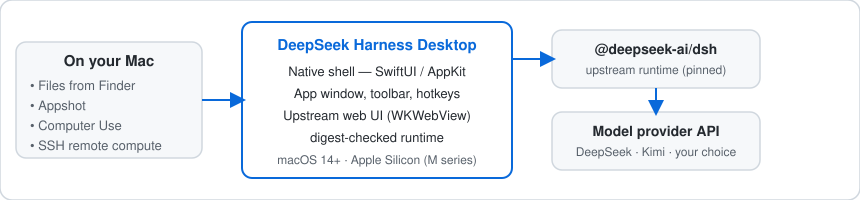

# DeepSeek Harness Desktop

<p align="center">
  <a href="README.zh-CN.md">简体中文</a> · English
</p>

<p align="center"><strong>A focused macOS companion for DeepSeek Harness — built for research files, deliberate Mac context, and optional remote compute.</strong></p>

> [!IMPORTANT]
> **Unofficial community project.** It is not affiliated with, maintained by, sponsored by, or endorsed by DeepSeek. This repository is a source preview; it does not ship a notarized public app.

<p align="center">
  <a href="https://github.com/tengqi159/deepseek-harness-desktop/actions/workflows/ci.yml"></a>
  
  
  
</p>

## What changed in 1.6.9

This source preview focuses on making the everyday attachment path dependable rather than adding another layer of complexity.

- **Image drops no longer borrow a model route from another conversation.** A delayed capability update from an old conversation can no longer send an image from an active DeepSeek conversation into the wrong upstream path and produce the misleading “current model does not support images” message.
- **Images can be dragged or pasted into a DeepSeek conversation.** Text-only or unknown routes fall back to a session-bound managed attachment instead of being rejected by the upstream image composer. Ordinary text paste remains ordinary text paste.
- **Removed attachments stay removed.** The attachment lifecycle now survives delayed acknowledgements, reloads, and a new blank conversation without restoring a discarded PDF, image, or Markdown card over your draft.
- **No accidental page reload while an attachment is arriving.** The native wrapper now treats equivalent local URLs as the same page, so a harmless trailing slash or client-side route change does not wipe the in-page attachment state.
- **A quieter toolbar.** File/library/Appshot/app-context actions live under one **Context & Attachments** menu. Dragging or pasting into the chat remains the direct way to add material to the current conversation.

## What it adds around upstream Harness

| When you need to… | Desktop companion behavior |
| --- | --- |
| Read a paper, inspect code, or work through a dataset | Drag PDFs, Office files, Markdown, source, data, and images into a conversation. They become removable, session-bound managed references; originals are never edited. |
| Pull a useful detail from a document | Let the model call bounded local Artifact tools for PDF search/page extraction, Office text extraction, and safe text reading. The app does not pretend a model has read a file merely because it was imported. |
| Capture a single window | Use **Appshot** (`⌘⇧⌥2`) for a one-time local capture with OCR/redaction and a preview before saving. |
| Ask for help inside another Mac app | Explicitly attach one running app. Accessibility/OCR actions are limited to that app, its current window, and a fresh snapshot. |
| Run a research task on a Linux server | Select one SSH host and workspace, then use the scoped remote-compute bridge. Inspection tools may be selected by a model; commands, jobs, cancellation, and transfers require immediate confirmation. |

### Images: clear routing, not a false promise

Dropping an image is supported. That does **not** automatically mean the selected model receives raw pixels:

- The pinned DeepSeek text route keeps the image as managed local context; the workflow may use local extraction/OCR tools on demand.
- A direct image block is used only for a verified, currently selected visual model.
- Unknown, changing, mixed, or expired routes fail closed to the managed-file path.

This keeps file handling useful without claiming that DeepSeek saw an image it was never sent.

## How it fits together

<p align="center">
  
</p>

The native layer owns the local file boundary, macOS permissions, one-shot Appshots, exact-app attachment, and optional SSH selection. Upstream Harness continues to own conversations, model selection, provider adapters, and its normal tool framework.

> The README intentionally uses this clean diagram rather than a redacted personal desktop screenshot. Fresh product screenshots will be added only when they can be made entirely from isolated demo data.

## Important boundaries

- **Source preview only.** No Developer ID–signed or Apple-notarized binary is published. Build and review it locally.
- **Apple Silicon / macOS 14+.** Intel support is not claimed.
- **Computer Use is scoped, not universal.** You must attach an exact app first. Known password, login, Keychain, and security surfaces are blocked, but no heuristic recognizes every custom sensitive interface.
- **SSH is deliberately narrow.** It uses your existing system OpenSSH/public-key setup; passwords, MFA prompts, interactive TTY, jump hosts, forwarding, and automatic host-key acceptance are out of scope. A workspace is routing scope, not a server-side sandbox.
- **No video or audio upload.** This project does not turn the pinned DeepSeek route into a general visual-model service.

## Build from source

Requirements: macOS 14+, Apple Silicon, Xcode Command Line Tools with Swift 5.10+, Node.js 22, and the pinned upstream runtime.

```bash
npm install -g @deepseek-ai/dsh@0.1.0-rc.6 --registry=https://registry.npmjs.org
git clone https://github.com/tengqi159/deepseek-harness-desktop.git
cd deepseek-harness-desktop
./scripts/build_and_run.sh package
```

The default package is ad-hoc signed for local development. It is not a distributable, trusted public binary. The companion verifies the expected upstream `dsh` version and executable digest; an unknown runtime is refused.

## Validation in this source preview

The current source tree passes a Release build and deterministic local regression suites for:

- native attachment lifecycle and session binding;
- real `WKWebView` drag/drop and clipboard routing;
- Artifact Bridge (17 checks), Appshot (26 checks), and a disposable Computer Use fixture (37 checks);
- Remote Host selection and an isolated fake-SSH bridge (29 checks across 11 tools, with **zero real server connections**).

These results are local engineering evidence, not a promise that every Mac, provider, or server configuration will behave identically.

## Documentation

[Privacy](docs/PRIVACY.md) · [Security](SECURITY.md) · [Distribution](docs/DISTRIBUTION.md) · [Artifact Bridge](integration/ARTIFACT_BRIDGE.md) · [SSH remote compute](docs/SSH_REMOTE_COMPUTE.md) · [Computer Use testing](app/APP_BRIDGE_TESTING.md) · [Contributing](CONTRIBUTING.md)

## License

MIT. Read [NOTICE](NOTICE.md) for upstream attribution and trademark boundaries.
