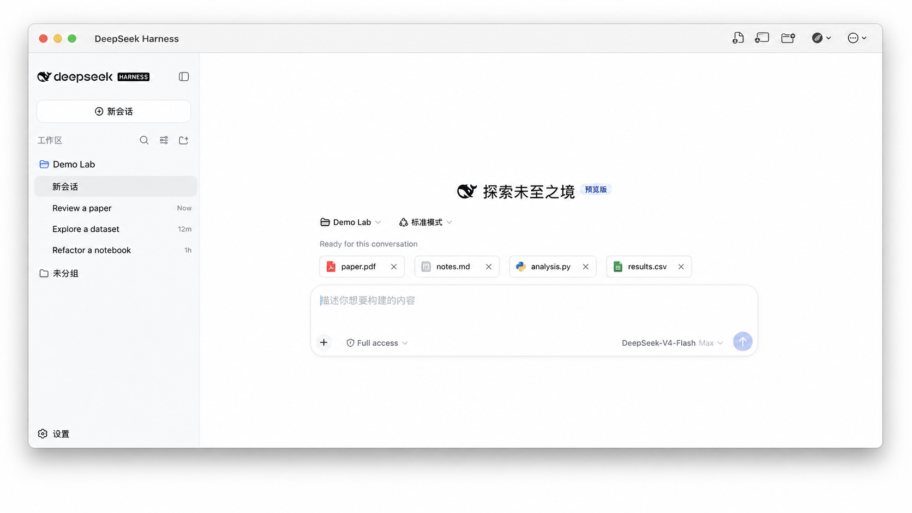
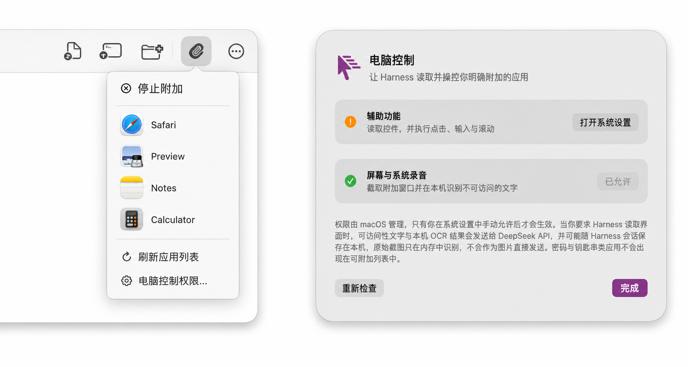

# DeepSeek Harness Desktop

<p align="center">
  <a href="README.zh-CN.md">简体中文</a> · English
</p>

<p align="center"><strong>The desktop client for DeepSeek Harness, built for Apple Silicon (M-series) Macs.</strong></p>

<p align="center">
  
</p>

<p align="center"><sub>Sanitized product demo based on the real interface. No user files, accounts, or API keys.</sub></p>

<p align="center">
  <a href="https://github.com/tengqi159/deepseek-harness-desktop/actions/workflows/ci.yml"></a>
  
  
</p>

## What this is

DeepSeek Harness Desktop wraps the upstream [DeepSeek Harness](https://github.com/deepseek-ai/deepseek-harness) runtime (`@deepseek-ai/dsh`) in a native Mac app. Conversations, models, and plugins stay upstream. The desktop client adds the parts that matter when the work lives on a Mac:

<p align="center">
  
</p>

- Drag papers, PDFs, Office files, code, and images from Finder straight into the conversation. Originals stay untouched.
- Appshot (`⌘⇧⌥2`): capture the frontmost window, secrets masked locally, preview before anything is saved.
- Computer Use: attach one app and operate it with Accessibility + local OCR; login, Keychain, and password fields are blocked.
- SSH remote compute for Linux research servers, public-key only.
- Images go to the model only when that provider/model is verified to see images; otherwise the pipeline falls back honestly.

<p align="center">
  
</p>

<p align="center"><sub>Attach one app and the client operates only within it. Sanitized product demo based on the real interface.</sub></p>

> [!NOTE]
> Unofficial community project, source preview only. No notarized binary yet — see [Distribution](docs/DISTRIBUTION.md).

## Quick start

Requires macOS 14+ on Apple Silicon (M series), Xcode Command Line Tools (Swift 5.10+), and Node.js 22.

```bash
npm install -g @deepseek-ai/dsh@0.1.0-rc.6 --registry=https://registry.npmjs.org
git clone https://github.com/tengqi159/deepseek-harness-desktop.git
cd deepseek-harness-desktop
./scripts/build_and_run.sh package
```

The client pins `dsh` 0.1.0-rc.6 and verifies its digest; unknown builds are refused. After first launch, add a provider in **Settings → Models**.

## Permissions

Accessibility and Screen Recording power the features above. They are granted by macOS — not by the app — and can be revoked anytime. Details: [Privacy](docs/PRIVACY.md).

## Current limits

- Source preview: no signed or notarized `.dmg` / `.zip` yet. Public binaries are blocked on Developer ID signing and notarization ([Distribution](docs/DISTRIBUTION.md)).
- Tested on Apple Silicon, macOS 14+; Intel is not claimed.
- The main UI is the upstream web UI inside `WKWebView`.
- No video/audio upload. Computer Use is semantic/OCR-based, not Codex-style vision.

## Docs

[Privacy](docs/PRIVACY.md) · [Security](SECURITY.md) · [Distribution](docs/DISTRIBUTION.md) · [Artifact Bridge](integration/ARTIFACT_BRIDGE.md) · [SSH remote compute](docs/SSH_REMOTE_COMPUTE.md) · [Computer Use testing](app/APP_BRIDGE_TESTING.md) · [Contributing](CONTRIBUTING.md)

## License

MIT. Upstream attribution and trademark boundaries: [NOTICE](NOTICE.md).
