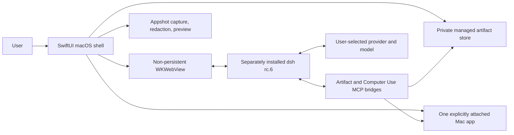

# DeepSeek Harness for macOS — Unofficial AI Agent Companion

<p align="center">
  <a href="README.zh-CN.md">简体中文</a> · English
</p>

> [!IMPORTANT]
> **Unofficial community project.** This repository is not affiliated with, maintained by, sponsored by, or endorsed by DeepSeek. “DeepSeek” and related marks belong to their respective owners. The separately installed upstream package remains the source of the Harness chat experience.

<p align="center">
  
</p>

<p align="center"><sub>Concept artwork, not a product screenshot. Real screenshots will use clean demo data only.</sub></p>

<p align="center">
  <a href="https://github.com/tengqi159/deepseek-harness-macos/actions/workflows/ci.yml"></a>
  
  
  
  
  
  <a href="LICENSE"></a>
</p>

Open Harness from **Applications**, drop research files straight into a conversation, take a privacy-aware Appshot, or attach one running Mac app for tightly scoped assistance. This project adds those native workflows around upstream `@deepseek-ai/dsh` without modifying the globally installed package.

> [!WARNING]
> This is a **Developer Preview** and currently a **source release**. There is no Apple-notarized public download yet. Build it locally, review the permissions you enable, and do not redistribute an unnotarized build as a trusted release.

## 60-second tour

1. **Open it like a Mac app.** A SwiftUI shell hosts the upstream Harness UI in a local `WKWebView`; no separate browser tab is needed after launch.
2. **Drop the material you actually work with.** PDFs, Markdown, source code, Office files, and mixed batches become removable draft cards. Pure image batches keep the upstream image path only when the exact model route is verified.
3. **Let the selected model use the safest available route.** Verified image-capable routes may keep native image input; documents and text-only routes become managed references that local tools can inspect or extract from on demand.
4. **Bring another app into the task—deliberately.** Attach one exact running process, then allow semantic Accessibility actions or optional local OCR for its focused window.
5. **See what is really ready.** Model Capability Center and Plugin Health Center expose routing decisions and startup discovery instead of pretending every provider or tool works the same way.

<!-- Future screenshot (sanitized demo only): docs/images/overview.png -->

## Version and support status

| Component | Current target | Meaning |
| --- | --- | --- |
| macOS companion | **1.4.1** (build 6) | Native shell and the additions in this repository |
| Upstream runtime | **`@deepseek-ai/dsh@0.1.0-rc.6`** | Installed separately; exact version and executable integrity are checked at launch |
| Operating system | **macOS 14+** | Apple Silicon is the tested hardware path; Intel is not yet validated |
| Distribution | **Source / Developer Preview** | A notarized, generally downloadable app is not available yet |

The version lock is intentional: upstream Harness is still a release candidate, so an untested global update fails closed instead of silently breaking the desktop integration.

## What is upstream, and what this project adds

| Experience | Upstream `@deepseek-ai/dsh` rc.6 | This macOS companion |
| --- | :---: | :---: |
| Conversations, workspaces, model settings, command tools, plans, goals, Todo, subagents, workflows, and jobs | ✅ | Uses them unchanged |
| Local web UI and plugin/Skill/MCP framework | ✅ | Hosts and extends the verified rc.6 client slots |
| Native macOS app window and toolbar | — | ✅ |
| General Finder drag-and-drop with removable, conversation-bound draft cards | Limited by the upstream composer | ✅ |
| Managed PDF, Office, Markdown, code, data, and mixed-file workbench | — | ✅ |
| Page-bounded PDF search/extraction and selected-page rendering | — | ✅ |
| One-shot Appshot with local redaction and preview | — | ✅ |
| Permission-scoped macOS app reading and control | — | ✅ |
| Kimi/provider model adapters | ✅ via upstream pi-ai routes | Adds a dated capability registry and fail-closed attachment routing |
| Live view of native bridge and attachment plugin startup health | — | ✅ |

This is a companion, not a replacement or a claim that upstream features were reimplemented here.

## What works today

### Files that behave like part of the conversation

For documents, text, code, Office files, and mixed batches, drop up to 32 ordinary files (512 MiB total per batch) from Finder onto a conversation. The app copies them atomically into its private managed area, keeps them bound to the conversation that received the drag, and shows removable cards beside the composer. A pure PNG/JPEG/WebP/GIF batch follows the upstream image composer only when the exact image-capable route is verified; that path is limited to 20 images, 5 MiB each, and 100 MiB total. Otherwise the images use managed cards too.

Removing a card removes its draft reference but keeps the managed copy in the research-file library; it does not touch the original file. The app never presses **Send** for you.

For PDFs and Office OOXML files (`.docx`, `.xlsx`, `.pptx`), a local helper can—when the model or user workflow chooses the tool—list files, extract bounded text, search PDFs with page references, and render selected PDF pages for review. These are **managed local references plus on-demand tool extraction**, not a promise that raw documents were uploaded to or natively understood by the selected model.

At import time, the file boundary rejects directories, packages, symbolic links, path traversal, changing inputs, and oversized payloads. When a managed Office/archive file is later inspected, the artifact helper separately rejects unsafe archive structures, macros, and embedded objects. Imported sources are read-only to the workflow; generated material belongs under the managed Exports area.

<!-- Future screenshot (sanitized demo only): docs/images/file-drop.png -->

### Appshot: a one-time, reviewable window capture

Appshot is separate from continuous Computer Use. The shortcut `⌘⇧⌥2` hides Harness, captures the exact frontmost focused window, reads local Accessibility/OCR context, masks likely secrets in text and pixels, and shows a preview. Nothing is saved until you confirm. The redacted image is the default; preserving original pixels is a separate choice, and sending an image to a provider still requires an explicit user action.

<!-- Future screenshot (sanitized demo only): docs/images/appshot-preview.png -->

### Computer Use, bounded to the app you attach

Choose **Attach App** in the native toolbar before the model can inspect or act on another application. The bundled Swift bridge uses public macOS APIs:

- Accessibility (`AXUIElement`) for the focused UI tree and semantic actions;
- ScreenCaptureKit plus Vision for optional, in-memory OCR of the attached app's focused window;
- CoreGraphics events for bounded keyboard, click, scroll, drag, selection, and wait actions;
- NSWorkspace for running-app discovery and activation.

Every control action is tied to the attached process, its lifetime, its focused window, and a fresh snapshot identity. Secure fields and credential-like content are blocked or redacted; known login, Keychain, password-manager, and security surfaces are blocked. These defenses cannot recognize every custom sensitive app or novel secret format. Consequential actions—sending, publishing, purchasing, deleting, installing, or changing permissions—must be described and confirmed immediately beforehand.

Raw Computer Use screenshots remain in memory and are not sent as image blocks. Bounded Accessibility/OCR **text** may become model context and remain in the local Harness session. This is useful semantic/OCR-assisted control; it is **not equivalent to Codex-style end-to-end visual computer control**.

<!-- Future screenshot (sanitized disposable fixture only): docs/images/attach-app.png -->

### Model-aware multimodal routing

The router intersects the current provider, exact model, upstream adapter, attachment transport, and an expiring capability record:

- The verified DeepSeek rc.6 route is treated as text-only. Images and PDFs therefore become managed references; a local tool can extract text or render metadata on demand. The app does not claim that the model saw raw pixels.
- Upstream `moonshotai-cn` and `moonshotai` pi-ai routes can retain native image message blocks when the selected Kimi model explicitly declares image input.
- Unknown, loading, mismatched, or expired capability records fail closed to the managed-file route.
- Mixed image-and-document batches use one managed route to avoid partial or duplicate handling.
- Video upload is **not shipped**, and no Kimi audio/transcription capability is assumed.

Provider API keys are configured through **Harness Settings → Models**. They are not stored in this repository or in the capability registry.

### Plugin health without misleading green lights

Bundled Skills are synchronized at launch; MCP bridges and the native attachment client are discovered during Harness startup. The health center distinguishes upstream preset tools from companion additions and can recheck their inventory.

“Active” means initialization, first discovery, and registration succeeded at that moment. It does **not** guarantee that a helper will remain connected later. A model may automatically choose a matching tool from its description, but tool choice is model-driven—not guaranteed—and safety confirmations still apply.

<!-- Future screenshot (sanitized demo only): docs/images/plugin-health.png -->

## Implemented, conditional, and not shipped

| Status | Capability |
| --- | --- |
| **Implemented** | Native app shell; general file drop; removable conversation-bound cards; managed artifact store; PDF/Office extraction; PDF page search/render; Appshot preview/redaction; exact-app bridge; capability registry; plugin health UI |
| **Conditional** | Accessibility for semantic UI reading/actions; Screen Recording for OCR/Appshot; a verified image-capable provider/model for direct image blocks; provider API credentials; a live helper after its startup check |
| **Not shipped** | Apple-notarized public binary; verified Intel build; general video uploader; audio transcription route; automatic permission granting; guaranteed tool invocation; Codex-equivalent visual computer control |

## Quick start from source

### Requirements

- macOS 14 or later; Apple Silicon is the currently tested path
- Xcode Command Line Tools with Swift 5.10 or later
- Node.js 22 and npm
- The exact verified upstream runtime: `@deepseek-ai/dsh@0.1.0-rc.6`

### 1. Install the pinned upstream runtime

```bash
npm install -g @deepseek-ai/dsh@0.1.0-rc.6 --registry=https://registry.npmjs.org
dsh --version
```

The second command must report `0.1.0-rc.6`. The companion checks both the version and the verified executable digest; it will refuse an unknown build.

### 2. Clone and build the companion

```bash
git clone https://github.com/tengqi159/deepseek-harness-macos.git
cd deepseek-harness-macos
./scripts/build_and_run.sh package
```

The default source build uses ad-hoc signing and creates `outputs/DeepSeek Harness.zip`. It does not silently install a certificate or modify your keychain. Maintainers who knowingly want one persistent local development identity can opt in:

```bash
DSH_LOCAL_SIGNING=1 ./scripts/build_and_run.sh package
```

That identity is still local development signing—not Apple Developer ID signing and not notarization.

### 3. Put it in Applications and open it

```bash
mkdir -p "$HOME/Applications"
ditto -x -k "outputs/DeepSeek Harness.zip" "$HOME/Applications"
open "$HOME/Applications/DeepSeek Harness.app"
```

On first launch, configure your provider under **Settings → Models**. Enable macOS permissions only for features you choose to use. A signing identity change can make macOS ask for those permissions again.

> [!NOTE]
> Keep only one installed copy of **DeepSeek Harness.app** to avoid duplicate macOS permission entries. The app uses its own Harness home under `~/Library/Application Support/DeepSeek Harness/` and does not rewrite the global npm package. On first setup, when the app-specific destination does not exist, it may copy existing `~/.dsh` model settings and credentials into that private home with owner-only permissions. Updating global `dsh` and updating this compatibility lock are deliberately separate release steps.

## Permissions and privacy boundaries

| Permission/data | Used for | Boundary |
| --- | --- | --- |
| Accessibility | Read semantic controls and perform bounded actions in the attached app | Granted manually in System Settings; never changed by the app |
| Screen Recording | Appshot and optional focused-window OCR | Capture is local; Computer Use pixels stay in memory |
| Provider API access | Harness conversations and model requests | The configured model provider can receive content the user/workflow sends; upstream search or opened links may contact other services |
| Managed files | Document and research workflows | Stored under `~/Library/Application Support/DeepSeek Harness/Artifacts`; originals are not modified |
| Local Harness state | Sessions, model configuration, integration files | Stored under the companion's Application Support directory, separate from normal `~/.dsh` history |

Harness is served only on a random loopback port inside a non-persistent web view. The random port reduces accidental collisions; it is not presented as a complete authentication or sandbox boundary. Read [Privacy](docs/PRIVACY.md) and [Security](SECURITY.md) before enabling control on sensitive applications. Never paste API keys into an issue or test fixture.

## Architecture



The native layer owns macOS lifecycle, drag-and-drop, permissions UI, file boundaries, Appshot, and exact-app attachment. Upstream Harness owns conversations, provider adapters, model selection, and its normal agent/tool framework.

## Build and test

Build the Swift package alone:

```bash
swift build --package-path app -c release
```

Run the repository regression suites:

The artifact fixture suite uses [`uv`](https://docs.astral.sh/uv/) to create an isolated Python environment with ReportLab and Pillow. Install `uv` before running the full list below; it is not required merely to build the Swift app.

```bash
./scripts/test_artifact_bridge.sh
./scripts/test_appshot_qa.sh
./scripts/test_native_file_drop.sh
./scripts/test_webview_file_drop.sh
./scripts/test_app_bridge_e2e.sh
```

Latest local release-audit evidence:

| Suite | Local result |
| --- | --- |
| Computer Use disposable-window fixture | 36 / 36 checks passed |
| Artifact bridge fixtures and boundary attacks | 17 / 17 checks passed |
| Appshot safety/regression checks | 26 checks passed |
| Native attachment and real `WKWebView` drag lifecycle | Passed |

These are local results, not a promise about every Mac. CI covers compilation and deterministic, non-TCC checks. Real window control, OCR, and permission behavior require a logged-in macOS session and must also be exercised locally against disposable test windows.

## Known limitations

- No notarized public `.dmg` or `.zip` is published yet; the current repository is source-first.
- Apple Silicon on macOS 14+ is tested. Intel Macs are not yet claimed as supported.
- The app intentionally accepts only the verified upstream rc.6 runtime/digest.
- The Harness interface is upstream web UI inside `WKWebView`, not a full native SwiftUI rewrite.
- DeepSeek's verified rc.6 route is treated as text-only; local OCR/extraction is not native vision.
- General video upload and audio transcription are not implemented.
- Computer Use is Accessibility/OCR assisted, depends on macOS permissions, and cannot see or operate every custom-drawn UI.
- Plugin health is a point-in-time startup check; automatic model tool selection is not guaranteed.

## Contributing

Issues and focused pull requests are welcome. Please read [CONTRIBUTING.md](CONTRIBUTING.md), keep upstream and companion behavior clearly separated, add regression coverage for bridge or lifecycle changes, and avoid committing real documents, screenshots, credentials, or personal app state.

For vulnerabilities or privacy boundary failures, follow [SECURITY.md](SECURITY.md) instead of opening a public issue.

## License and acknowledgements

This companion source is released under the [MIT License](LICENSE). See [NOTICE.md](NOTICE.md) for attribution and trademark boundaries.

DeepSeek Harness, distributed separately as [`@deepseek-ai/dsh`](https://www.npmjs.com/package/@deepseek-ai/dsh), provides the upstream conversations, providers, tools, and web experience. This repository exists because that foundation is useful—and because Mac users benefit from a carefully bounded native bridge around it.
