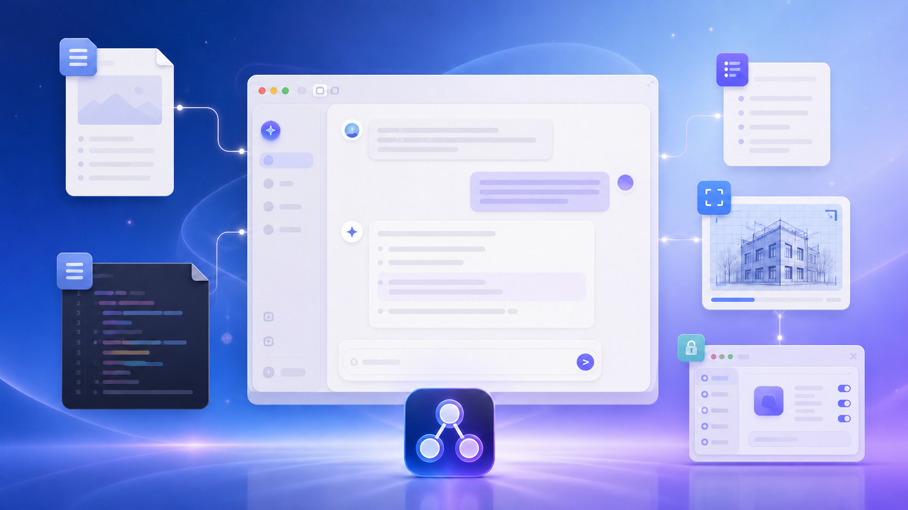
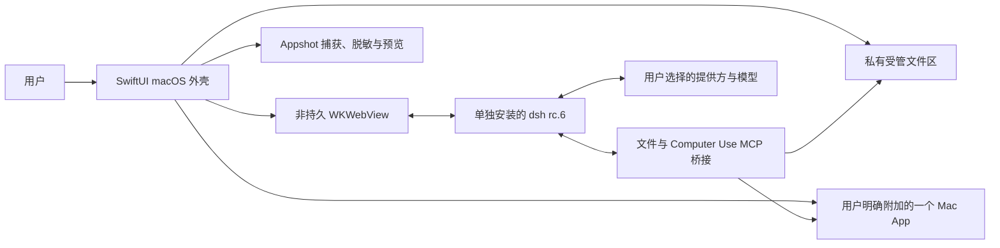

# DeepSeek Harness for macOS — 非官方 AI Agent 桌面伴侣

<p align="center">
  简体中文 · <a href="README.md">English</a>
</p>

> [!IMPORTANT]
> **这是非官方社区项目。** 本仓库不隶属于 DeepSeek，也未获得其维护、赞助或背书。“DeepSeek”等相关标识归各自权利人所有。Harness 的对话体验仍由单独安装的上游软件包提供。

<p align="center">
  
</p>

<p align="center"><sub>上图是宣传概念图，不是产品截图。后续真实截图只会使用无隐私的演示数据。</sub></p>

<p align="center">
  <a href="https://github.com/tengqi159/deepseek-harness-macos/actions/workflows/ci.yml"></a>
  
  
  
  
  
  <a href="LICENSE"></a>
</p>

像普通 Mac 软件一样从“应用程序”打开 Harness；把论文、图片和代码直接拖进会话；先预览、脱敏，再保存 Appshot；也可以明确“附加”一个正在运行的软件，让 Agent 在严格边界内读取和操作它。本项目在上游 `@deepseek-ai/dsh` 外围补上这些 macOS 原生能力，不修改全局安装的上游软件包。

> [!WARNING]
> 当前是**开发者预览版**，也是**源码发布版**。现在还没有经过 Apple 公证、可供普通用户直接下载的安装包。请从源码本机构建，只开启你真正需要的系统权限，也不要把未经公证的构建包装成可信正式版传播。

## 60 秒看懂它

1. **像 Mac App 一样打开。** SwiftUI 外壳在本地 `WKWebView` 中承载上游 Harness 界面，启动后不需要另开浏览器标签页。
2. **把真实研究材料直接拖进来。** PDF、Markdown、代码、Office 文件和混合文件会变成可删除的草稿卡片；只有在精确模型路由已验证时，纯图片批次才保留上游图片通道。
3. **按当前模型选择最诚实、最安全的通道。** 已验证支持图片的模型可以保留原生图片输入；文档和纯文本模型会变成受管引用，再由本地工具按需检查或提取。
4. **需要操作其他软件时，先明确附加。** 只绑定一个确切进程，再通过辅助功能语义控件或可选的本地 OCR 读取其当前窗口。
5. **清楚看到哪些能力真的可用。** “模型能力中心”和“插件健康中心”展示当前路由与启动发现结果，不把所有模型、插件都说成无条件可用。

<!-- 未来截图位置（只能使用无隐私演示数据）：docs/images/overview.png -->

## 版本与支持状态

| 组件 | 当前目标 | 含义 |
| --- | --- | --- |
| macOS 桌面伴侣 | **1.4.1**（build 6） | 本仓库提供的原生外壳与增强能力 |
| 上游运行时 | **`@deepseek-ai/dsh@0.1.0-rc.6`** | 单独安装；启动时校验精确版本和可执行文件完整性 |
| 操作系统 | **macOS 14+** | 已测试 Apple Silicon；暂未验证 Intel |
| 发布形态 | **源码 / 开发者预览版** | 暂无 Apple 公证的通用下载版 App |

锁定版本是有意设计：上游 Harness 仍是候选预览版，所以未经兼容性验证的全局更新会安全停止，而不是悄悄破坏桌面集成。

## 哪些来自上游，哪些是我们新增的

| 使用体验 | 上游 `@deepseek-ai/dsh` rc.6 | 本 macOS 桌面伴侣 |
| --- | :---: | :---: |
| 会话、工作区、模型设置、命令工具、计划、目标、Todo、子 Agent、工作流和任务 | ✅ | 原样使用 |
| 本地 Web 界面，以及插件 / Skill / MCP 框架 | ✅ | 承载并扩展已验证 rc.6 的客户端插槽 |
| 原生 macOS 窗口与工具栏 | — | ✅ |
| Finder 通用拖放、可删除且绑定当前会话的草稿卡片 | 受上游输入框限制 | ✅ |
| PDF、Office、Markdown、代码、数据和混合文件的受管研究文件区 | — | ✅ |
| 按页限制的 PDF 搜索、提取和指定页面渲染 | — | ✅ |
| 本地脱敏、可预览的一次性 Appshot | — | ✅ |
| 受权限和应用绑定约束的 macOS 读取与操作 | — | ✅ |
| Kimi 等模型提供方适配器 | ✅，由上游 pi-ai 路由提供 | 新增带有效期的能力表和保守附件路由 |
| 原生桥接与附件插件的启动健康状态 | — | ✅ |

它是“桌面伴侣”，不是替代品，也不会把上游已经具备的能力包装成我们的重新实现。

## 现在已经能做什么

### 文件真正进入当前会话流程

对于文档、文本、代码、Office 文件与混合批次，可以从 Finder 向会话拖入最多 32 个普通文件，单批总计不超过 512 MiB。App 会把它们原子复制到私有受管目录，绑定到接收拖放的那一个会话，并在输入框旁显示可删除卡片。只有精确图片模型路由已验证时，纯 PNG/JPEG/WebP/GIF 批次才走上游图片输入；该通道最多 20 张、每张 5 MiB、总计 100 MiB。其他情况下图片也使用受管卡片。

删除卡片只删除草稿引用，受管副本仍保留在研究文件库中；原始文件不会被改动。App 也绝不会替你自动点击**发送**。

对于 PDF 与 Office OOXML 文件（`.docx`、`.xlsx`、`.pptx`），当模型或用户工作流选择相应工具时，本地助手能够列出文件、提取受限文本、按页码搜索 PDF，以及渲染指定 PDF 页面供检查。这里提供的是**受管本地引用 + 按需工具提取**，不代表原始文档已上传，也不代表当前模型天然理解了整份文件。

导入时，文件边界会拒绝文件夹、App 包、符号链接、路径穿越、复制过程中发生变化的文件及超限负载。当受管 Office / 压缩文件之后被读取时，研究文件助手还会单独拒绝危险压缩结构、宏和嵌入对象。导入源文件不会被工作流覆盖；新生成或修改的成果应写入受管 Exports 区域。

<!-- 未来截图位置（只能使用无隐私演示数据）：docs/images/file-drop.png -->

### Appshot：一次性、先检查再保存的窗口快照

Appshot 与持续的电脑控制相互独立。按下 `⌘⇧⌥2` 后，Harness 会暂时隐藏，捕获当时最前方且获得焦点的准确窗口，在本机读取辅助功能 / OCR 上下文，对文字和像素中的疑似秘密进行遮盖，再展示预览。确认前不会保存任何内容。默认保存脱敏后的图片；保留原始像素需要单独选择，而把图片发送给模型仍需明确的用户操作。

<!-- 未来截图位置（只能使用无隐私演示数据）：docs/images/appshot-preview.png -->

### Computer Use：只操作你明确附加的软件

必须先在原生工具栏中选择**附加 App**，模型才有机会检查或操作另一个软件。随 App 打包的 Swift 桥接只使用 macOS 公共 API：

- 通过辅助功能（`AXUIElement`）读取当前窗口的语义控件并执行语义操作；
- 通过 ScreenCaptureKit 与 Vision，对所附加 App 的当前焦点窗口进行可选的内存 OCR；
- 通过 CoreGraphics 执行受限的键盘、点击、滚动、拖动、选择与等待操作；
- 通过 NSWorkspace 发现和激活正在运行的软件。

每次控制操作都绑定到确切进程、进程生命周期、当前焦点窗口和最新快照身份。安全输入框与疑似凭据会被拒绝或脱敏；已知的登录、钥匙串、密码管理器和系统安全界面会被阻止，但这些防护无法识别所有自绘敏感软件或新型秘密格式。发送、发布、购买、删除、安装、修改权限等重要外部动作，必须在执行前说明清楚并获得当次确认。

Computer Use 的原始截图只留在内存中，不会作为图片块发送；受限的辅助功能 / OCR **文字**可能进入模型上下文，并保留在本地 Harness 会话记录中。这是基于语义控件和 OCR 的辅助操作，**不等同于 Codex 那种端到端视觉电脑控制**。

<!-- 未来截图位置（只能使用无隐私的一次性测试窗口）：docs/images/attach-app.png -->

### 根据模型真实能力进行多模态路由

路由器会同时检查当前提供方、精确模型、上游适配器、附件传输通道，以及带有效期的能力记录：

- 已验证的 DeepSeek rc.6 路由按纯文本处理。图片和 PDF 会成为受管引用，再由本地工具按需提取文字或渲染信息；App 不会声称模型看到了原始像素。
- 上游 `moonshotai-cn` 和 `moonshotai` 的 pi-ai 路由，在所选 Kimi 模型明确声明支持图片时，可以保留原生图片消息块。
- 能力未知、加载中、不匹配或已过期时，保守回退到受管文件通道。
- 图片与文档混合批次统一走受管通道，避免部分失败或重复处理。
- 当前**没有提供视频上传器**，也不会擅自假设 Kimi 具有音频 / 转写能力。

API key 请在 **Harness 设置 → Models** 中配置。密钥不会写入本仓库，也不会写入模型能力表。

### 插件健康状态：不制造误导性的“全绿”

随 App 提供的 Skills 会在启动时同步，MCP 桥接与原生附件客户端则由 Harness 在启动过程中发现。“插件健康中心”会区分上游预设工具和本项目新增能力，并允许重新检查清单。

“已启用”只表示当时完成了初始化、首次发现和注册，**不保证**某个助手之后永远在线。模型可以根据工具描述自动选择匹配插件，但选择权仍在模型，不保证每次调用；所有安全确认仍然有效。

<!-- 未来截图位置（只能使用无隐私演示数据）：docs/images/plugin-health.png -->

## 已实现、有条件可用、尚未提供

| 状态 | 能力 |
| --- | --- |
| **已实现** | 原生 App 外壳；通用文件拖放；会话绑定且可删除的卡片；受管文件区；PDF / Office 提取；PDF 按页搜索与渲染；Appshot 预览脱敏；精确应用桥接；模型能力表；插件健康界面 |
| **有条件可用** | 辅助功能权限用于语义读取 / 操作；屏幕录制权限用于 OCR / Appshot；已验证支持图片的模型路由用于原生图片块；对应提供方的 API 凭据；启动检查后仍保持在线的本地助手 |
| **尚未提供** | Apple 公证的公开安装包；经过验证的 Intel 版本；通用视频上传器；音频转写通道；自动授予系统权限；保证模型一定调用某工具；等同 Codex 的视觉电脑控制 |

## 从源码快速开始

### 环境要求

- macOS 14 或更高版本；目前验证的是 Apple Silicon
- 带 Swift 5.10 或更高版本的 Xcode Command Line Tools
- Node.js 22 与 npm
- 精确的已验证上游运行时：`@deepseek-ai/dsh@0.1.0-rc.6`

### 1. 安装锁定的上游运行时

```bash
npm install -g @deepseek-ai/dsh@0.1.0-rc.6 --registry=https://registry.npmjs.org
dsh --version
```

第二条命令必须输出 `0.1.0-rc.6`。桌面伴侣会同时检查版本与已验证的可执行文件摘要，不接受来源未知的构建。

### 2. 下载并构建桌面伴侣

```bash
git clone https://github.com/tengqi159/deepseek-harness-macos.git
cd deepseek-harness-macos
./scripts/build_and_run.sh package
```

默认源码构建使用 ad-hoc 签名，并生成 `outputs/DeepSeek Harness.zip`；不会悄悄安装证书或修改你的钥匙串。明确需要稳定本地开发签名身份的维护者可以主动开启：

```bash
DSH_LOCAL_SIGNING=1 ./scripts/build_and_run.sh package
```

它仍然只是本机开发签名，不是 Apple Developer ID 签名，也没有经过 Apple 公证。

### 3. 放入“应用程序”并打开

```bash
mkdir -p "$HOME/Applications"
ditto -x -k "outputs/DeepSeek Harness.zip" "$HOME/Applications"
open "$HOME/Applications/DeepSeek Harness.app"
```

第一次启动后，请在 **设置 → Models** 中配置模型提供方。只为你打算使用的功能开启 macOS 权限。若更换签名身份，系统可能要求重新授权。

> [!NOTE]
> 请只保留一份 **DeepSeek Harness.app**，避免 macOS 出现重复权限条目。App 使用 `~/Library/Application Support/DeepSeek Harness/` 下的独立 Harness 主目录，不会改写全局 npm 软件包。首次设置时，如果 App 专用目标文件尚不存在，它可能把现有 `~/.dsh` 模型设置与凭据复制到该私有目录，并设置为仅当前用户可读写。更新全局 `dsh` 与更新本项目的兼容锁是两个有意分开的发布步骤。

## 权限与隐私边界

| 权限 / 数据 | 用途 | 边界 |
| --- | --- | --- |
| 辅助功能 | 读取语义控件，并在已附加 App 中执行受限操作 | 只能在系统设置中手动授权；App 不会自行更改 |
| 屏幕录制 | Appshot 与可选的当前窗口 OCR | 本地捕获；Computer Use 像素只留在内存 |
| 模型提供方 API | Harness 对话与模型请求 | 已配置模型提供方可能收到用户 / 工作流发送的内容；上游搜索或打开链接也可能访问其他服务 |
| 受管文件 | 文档与研究工作流 | 存放在 `~/Library/Application Support/DeepSeek Harness/Artifacts`；不修改原文件 |
| 本地 Harness 状态 | 会话、模型配置与集成文件 | 存放在桌面伴侣的 Application Support 目录，与普通 `~/.dsh` 历史分离 |

Harness 只在随机回环端口提供服务，并使用非持久 `WKWebView`。随机端口能够减少意外冲突，但这里不会把它描述成完整的身份验证或沙箱边界。启用敏感软件控制前，请阅读[隐私说明](docs/PRIVACY.md)与[安全策略](SECURITY.md)。不要把真实 API key 粘贴到 Issue 或测试样例中。

## 架构



原生层负责 macOS 生命周期、拖放、权限界面、文件边界、Appshot 和精确应用附加；上游 Harness 负责会话、提供方适配、模型选择以及原有 Agent / 工具框架。

## 构建与测试

只构建 Swift 包：

```bash
swift build --package-path app -c release
```

运行仓库回归测试：

研究文件夹具测试使用 [`uv`](https://docs.astral.sh/uv/) 创建带 ReportLab 与 Pillow 的隔离 Python 环境。运行下面完整测试前请先安装 `uv`；只构建 Swift App 时不需要它。

```bash
./scripts/test_artifact_bridge.sh
./scripts/test_appshot_qa.sh
./scripts/test_native_file_drop.sh
./scripts/test_webview_file_drop.sh
./scripts/test_app_bridge_e2e.sh
```

最近一次本地发布审计记录：

| 测试套件 | 本地结果 |
| --- | --- |
| Computer Use 一次性测试窗口 | 36 / 36 项通过 |
| 文件桥接样例与边界攻击 | 17 / 17 项通过 |
| Appshot 安全 / 回归检查 | 26 项通过 |
| 原生附件与真实 `WKWebView` 拖放生命周期 | 通过 |

以上是本地结果，不代表每台 Mac 都必然相同。CI 负责编译与不依赖 TCC 的确定性检查；真实窗口控制、OCR 与系统权限行为需要登录状态的 macOS 会话，也必须在一次性测试窗口中进行本地验收。

## 已知限制

- 暂无经过 Apple 公证的公开 `.dmg` 或 `.zip`；当前以源码发布为主。
- 已测试 Apple Silicon + macOS 14 以上；暂不宣称支持 Intel Mac。
- App 有意只接受通过验证的上游 rc.6 运行时和摘要。
- Harness 主界面是 `WKWebView` 中的上游 Web UI，不是完整 SwiftUI 重写。
- 已验证的 DeepSeek rc.6 路由按纯文本处理；本地 OCR / 提取不等于模型原生视觉。
- 尚未实现通用视频上传和音频转写。
- Computer Use 依赖辅助功能 / OCR 与系统权限，无法识别或操作所有自绘界面。
- 插件健康状态只是某一时刻的启动检查；不保证模型一定自动调用工具。

## 参与贡献

欢迎提交 Issue 和范围清晰的 Pull Request。请先阅读 [CONTRIBUTING.md](CONTRIBUTING.md)，清楚区分上游与桌面伴侣行为，为桥接和生命周期改动补充回归测试，也不要提交真实文档、截图、凭据或个人软件状态。

如果发现漏洞或隐私边界失效，请按照 [SECURITY.md](SECURITY.md) 私下报告，不要直接创建公开 Issue。

## 许可证与致谢

本桌面伴侣源码以 [MIT License](LICENSE) 发布。上游归属、依赖说明与商标边界见 [NOTICE.md](NOTICE.md)。

单独分发的 DeepSeek Harness 软件包 [`@deepseek-ai/dsh`](https://www.npmjs.com/package/@deepseek-ai/dsh) 提供上游会话、模型提供方、工具和 Web 体验。本项目建立在这套有价值的基础之上，并为 Mac 用户补充了一层尽量清楚、保守、可验证的原生边界。
